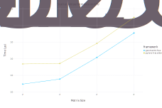

# GeometricFlux.jl

<p align="center">

</p>

[](https://yuehhua.github.io/GeometricFlux.jl/stable)
[](https://yuehhua.github.io/GeometricFlux.jl/dev)
[](https://travis-ci.org/yuehhua/GeometricFlux.jl)
[](https://codecov.io/gh/yuehhua/GeometricFlux.jl)
[](https://gitlab.com/JuliaGPU/GeometricFlux-jl/commits/master)
[](https://gitlab.com/JuliaGPU/GeometricFlux-jl/commits/master)

GeometricFlux is a geometric deep learning library for [Flux](https://github.com/FluxML/Flux.jl). This library aims to be compatible with packages from [JuliaGraphs](https://github.com/JuliaGraphs) ecosystem and have support of CUDA GPU acceleration with [CuArrays](https://github.com/JuliaGPU/CuArrays.jl). Message passing scheme is implemented as a flexbile framework and fused with Graph Network block scheme. GeometricFlux is compatible with other packages that are composable with Flux.

Suggestions, issues and pull requsts are welcome.

## Installation

```
]add GeometricFlux
```

## Features

Construct layers from adjacency matrix or graph (maybe extend to other structures).
Input features (including vertex, edge or graph features) of neural network may not need a structure or type.
Labels or features for output of classification or regression are part of training data, they may not need a specific structure or type, too.

* **NOTICE**: Scatter operations on CUDA are only supported in v1.3 (due to new feature in CUDAnative v2.8 which only supports julia v1.3). CPU version scatter operations are always available.

## Benchmark

Scatter operations are fundamental to GeometricFlux.jl and they are implemented in CPU and CUDA version. Benchmarks of scatter operations are done with scripts in benchmark folder. Statistics, includes max, min and mean, are shown in the following plots.



Performance of scatter add operations in GeometricFlux is better than pytorch_scatter on cuda.


However, performance in GeometricFlux is even worse than pytorch_scatter on cpu/threading.
