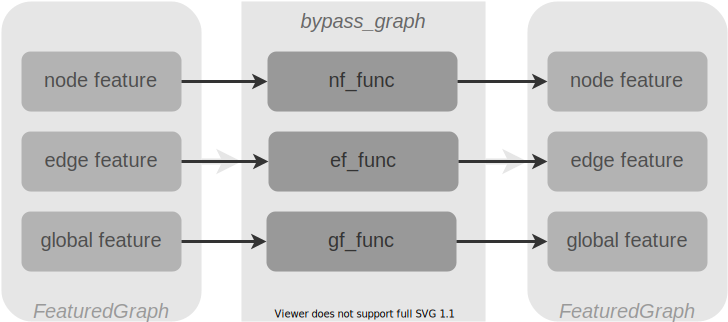

# Cooperate with Flux layers

GeometricFlux is designed to be compatible with Flux layers. Flux layers usually have array input and array output. In GeometricFlux, there are are two APIs which allow different input/output types for GNN layers. For example, `GCNConv` layer provides the following two APIs:

```julia
(g::GCNConv)(X::AbstractMatrix) -> AbstractMatrix
(g::GCNConv)(fg::FeaturedGraph) -> FeaturedGraph
```

If your feed a `GCNConv` layer with a `Matrix`, it will return you a `Matrix`. If you feed a `GCNConv` layer with a `FeaturedGraph`, it will return you a `FeaturedGraph`. **These APIs ensure the consistency between input and output types.** What you feed is what you get. So, the API for array type is compatible directly with other Flux layers. However, the API for `FeaturedGraph` is not compatible directly.

## Fetching features from `FeaturedGraph` and output compatible result with Flux layers

With a layer outputs a `FeaturedGraph`, it is not compatible with Flux layers. Since Flux layers need single feature in array form as input, node features, edge features and global features can be selected by using `FeaturedGraph` APIs: `node_feature`, `edge_feature` or `global_feature`, respectively.

```julia
model = Flux.Chain(
    GCNConv(1024=>256, relu),
    node_feature,  # or edge_feature or global_feature
    softmax
)
```

In a multitask learning scenario, multiple outputs are required. A branching selection of features can be made as follows:

```julia
model = Flux.Chain(
    GCNConv(1024=>256, relu),
    x -> (node_feature(x), global_feature(x)),
    (nf, gf) -> (softmax(nf), identity.(gf))
)
```

## Branching different features through different layers



A `bypass_graph` function is designed for passing each feature through different layers from a `FeaturedGraph`. An example is given as follow:

```julia
Flux.Chain(
    ...
    bypass_graph(
        nf_func=GCNConv(1024=>256, relu),
        ef_func=Dense(1024, 256, relu),
        gf_func=identity,
    ),
    ...
)
```

`bypass_graph` will pass node feature to a `GCNConv` layer and edge feature to a `Dense` layer. Meanwhile, a `FeaturedGraph` is decomposed and keep the graph in `FeaturedGraph` to the downstream layers. A new `FeaturedGraph` is constructed with processed node feature, edge feature and global feature. `bypass_graph` acts as a layer which accepts a `FeaturedGraph` and output a `FeaturedGraph`. Thus, it by pass the graph in a `FeaturedGraph` but pass different features to different layers.
